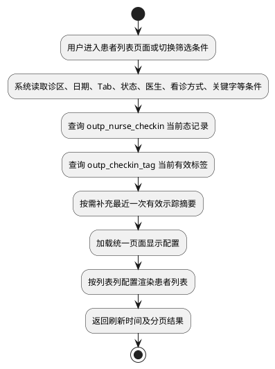
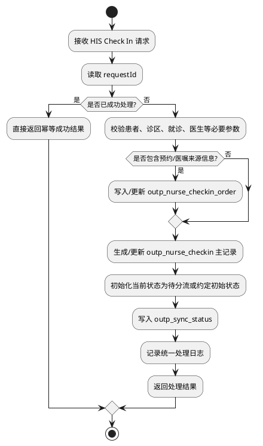
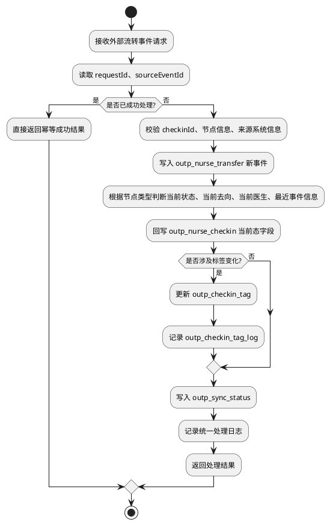
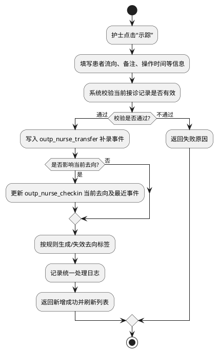
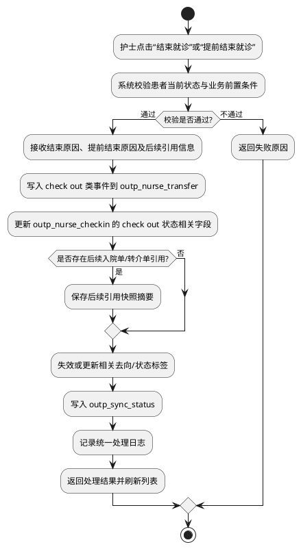
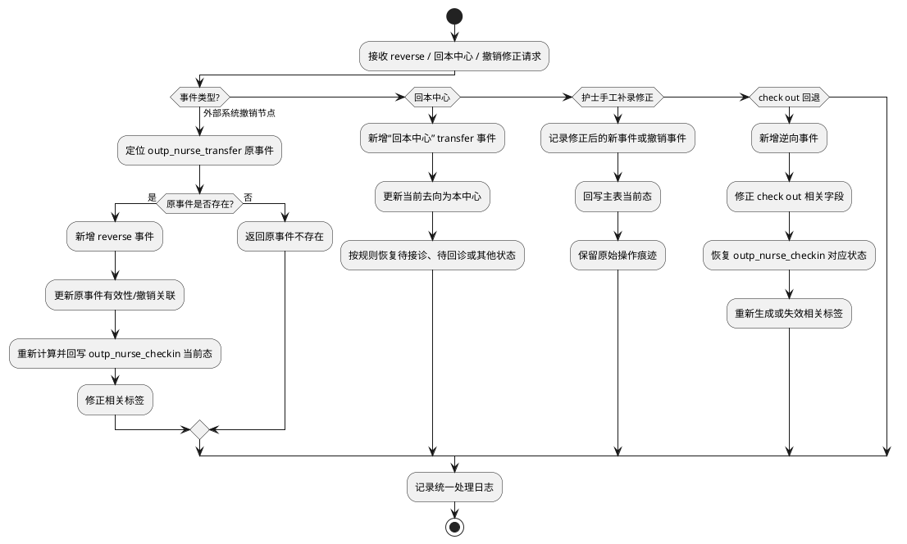
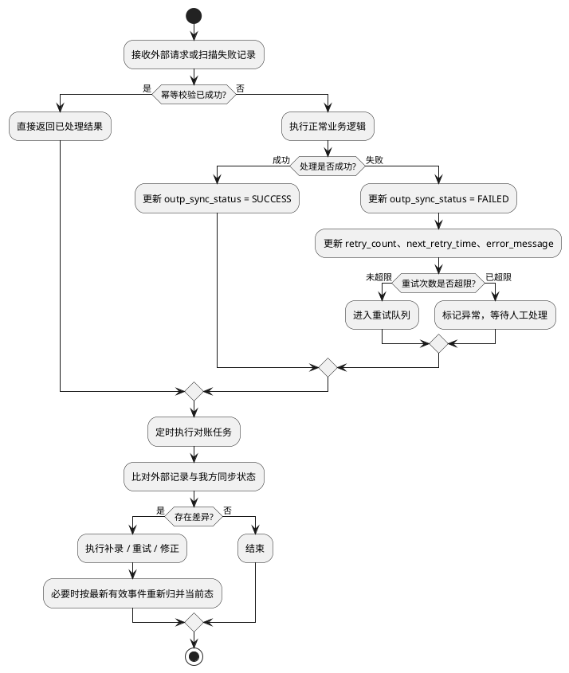

# 4.2.4.5 流程逻辑 - PlantUML 草稿

> 说明：这里是 `4.2.4.5` 下需要绘制的 **7 个流程图**
> 不是 8 个，因为 `4.2.4.5.1` 是“设计说明”，不是独立业务流程
> 真正需要画图的是 `4.2.4.5.2 ~ 4.2.4.5.8` 这 7 个流程

---

## 4.2.4.5.2 患者列表加载流程

---

## 4.2.4.5.3 HIS Check In 接诊写入流程

---

## 4.2.4.5.4 外部系统推送患者流转流程

---

## 4.2.4.5.5 护士手工补录患者流向流程

---

## 4.2.4.5.6 结束就诊 / 提前结束就诊流程

---

## 4.2.4.5.7 逆流程处理

---

## 4.2.4.5.8 幂等、重试与对账处理流程

