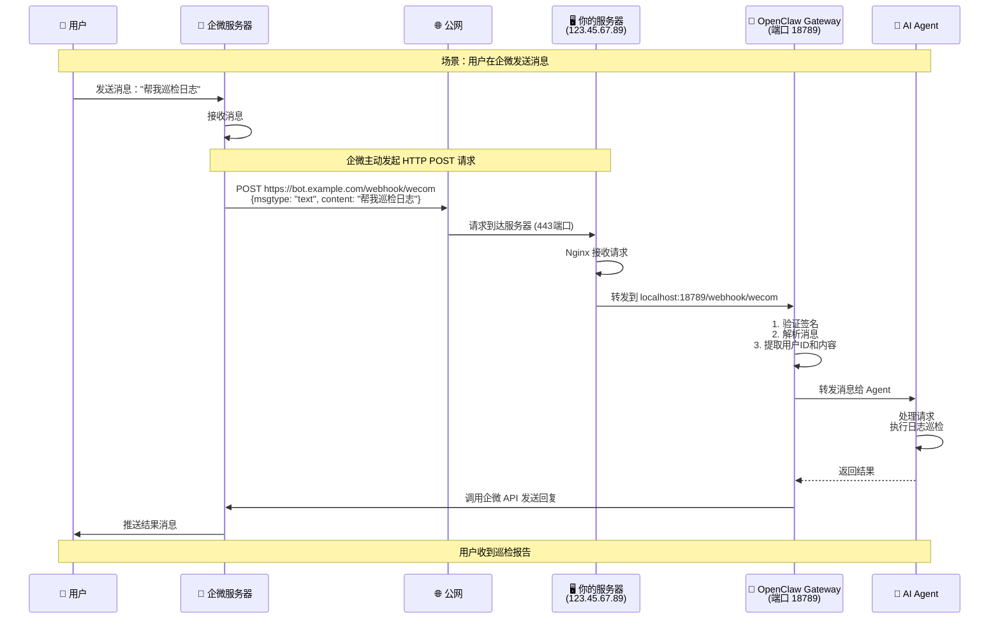
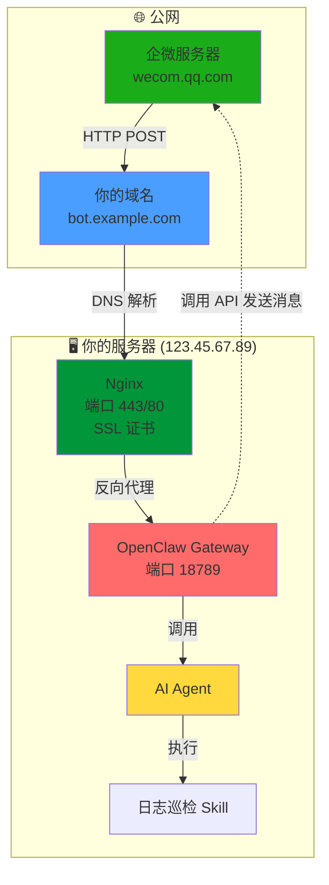
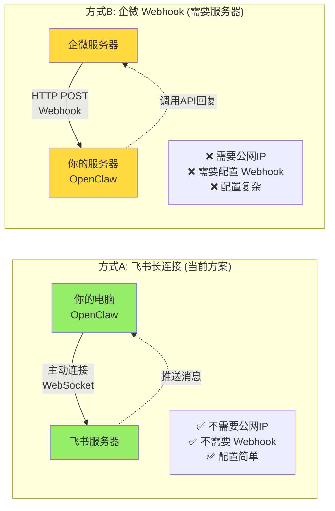
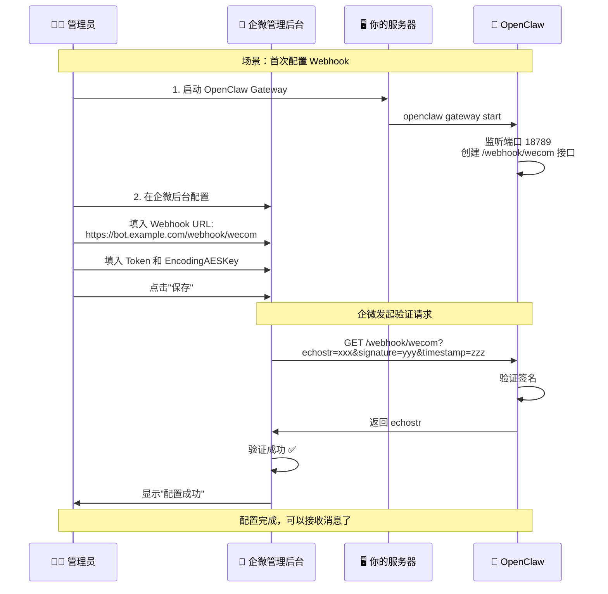
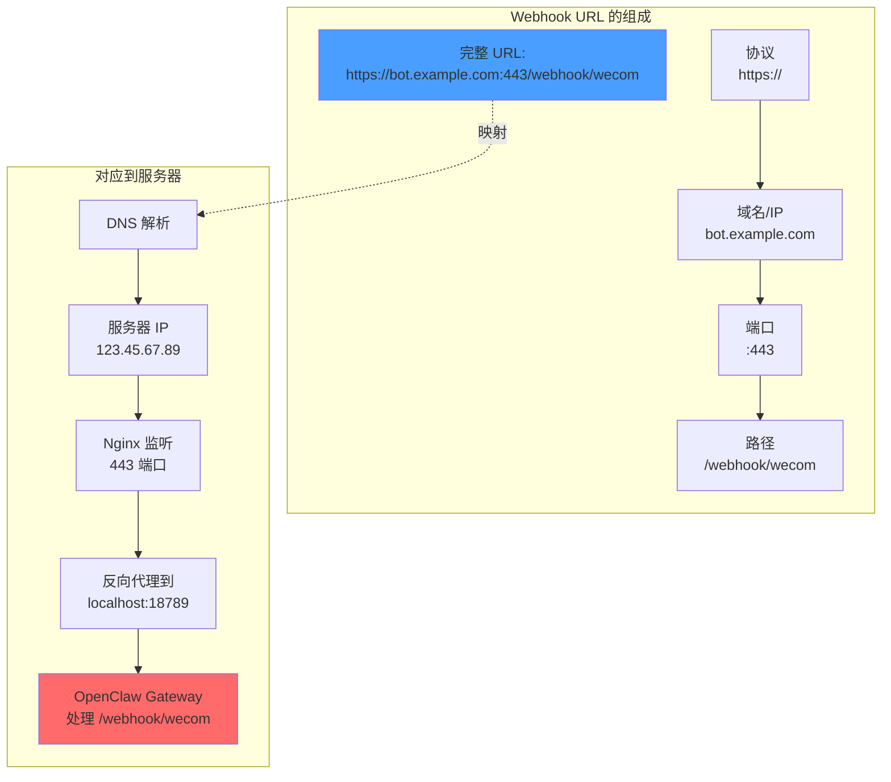
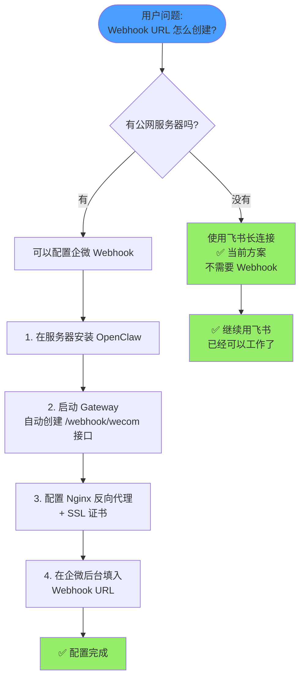

# 图1: 企微 Webhook 完整流程

这个图展示了从用户发消息到收到回复的完整过程。

---

# 图2: 服务器架构图

这个图展示了各个组件的关系和数据流向。

---

# 图3: 飞书 vs 企微 对比

这个图对比了两种方案的连接方式。

---

# 图4: Webhook 配置流程

这个图展示了如何配置企微 Webhook。

---

# 图5: Webhook URL 解析

这个图展示了 Webhook URL 的各个部分如何对应到服务器配置。

---

# 图6: 决策流程

这个图帮助你理解什么时候需要 Webhook。

