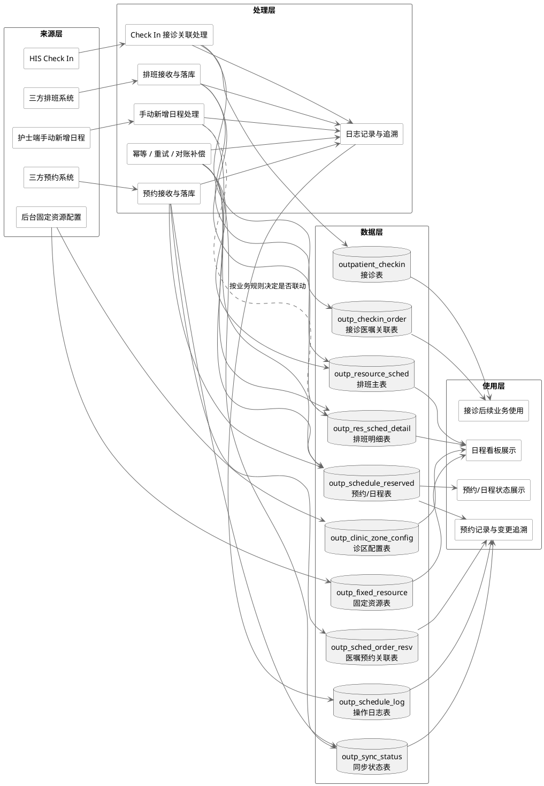

# 4.2.2.2.1 核心数据流转图 - 重构版（2026-03-26）

> 用途：用于替换 `4.2.2.2.1 核心数据流转图` 的旧版表达。
> 目标：解决“功能模块、处理动作、数据表混在一起”的问题，把图收敛成 **来源层 / 处理层 / 数据层 / 使用层** 四层结构。
> 适用场景：直接作为文档正文说明、画图依据、评审讲解底稿。

---

## 一、重构原则

### 1. 图中严格区分 4 个层次

#### （1）来源层
只放“谁把数据带进来”，不放表。

包括：
- 三方排班系统
- 三方预约系统
- 护士端手动新增日程
- HIS Check In
- 后台固定资源配置

#### （2）处理层
只放“系统在做什么处理”，不直接写字段明细。

包括：
- 排班接收与落库
- 预约接收与落库
- 手动新增日程处理
- Check In 接诊关联处理
- 幂等 / 重试 / 对账补偿
- 日志记录与追溯

#### （3）数据层
只放核心表，不再把表画成功能动作。

包括：
- `outp_clinic_zone_config`
- `outp_fixed_resource`
- `outp_resource_sched`
- `outp_res_sched_detail`
- `outp_schedule_reserved`
- `outp_sched_order_resv`
- `outpatient_checkin`
- `outp_checkin_order`
- `outp_schedule_log`
- `outp_sync_status`

#### （4）使用层
只放前端/下游是怎么消费这些数据，不再继续展开流程。

包括：
- 日程看板展示
- 预约/日程状态展示
- 预约记录与变更追溯
- 接诊后续业务使用

---

## 二、旧版图的主要问题

### 1. 功能节点和数据表混用
例如把“手动新增日程”“三方推送预约”“`outp_schedule_reserved`”都混在一张关系图同一层，看起来像谁都在直接调用谁，评审时会很乱。

### 2. 一张图里同时表达了三种问题
旧版图其实同时在讲：
- 数据来源是谁
- 数据处理步骤是什么
- 最终写到哪些表

这三件事混在一张平铺图里，视觉上必然打架。

### 3. 缺少“排班数据推送”作为独立主链路
昨天纪要提到这个点是对的。排班推送应该作为与预约推送并列的一级来源链路，不能只藏在说明文字里。

### 4. “手动新增日程是否更新排班明细状态”被画成确定逻辑
这个口径目前仍是 **待业务确认项**，图里不应该画成绝对必然更新，而应标注为“按业务规则决定是否联动”。

---

## 三、重构后的图面结构建议

### 结构顺序
建议从左到右画：
- 来源层 → 处理层 → 数据层 → 使用层

### 视觉规范建议
- **来源层**：圆角矩形
- **处理层**：标准矩形
- **数据层**：数据库/圆柱体或非矩形数据图形
- **使用层**：圆角矩形
- **待确认逻辑**：虚线箭头 + 备注说明
- **日志/同步状态**：用“贯穿支撑”方式连接，不要和业务主链抢主路径

---

## 四、建议写进正文的配套说明

### 4.2.2.2.1.1 图示说明（可直接贴正文）

预约日程管理模块的核心数据流转，应按“来源层—处理层—数据层—使用层”进行分层表达。来源层描述外部系统和用户操作如何触发业务数据进入本系统；处理层描述系统内部对排班、预约、手动新增日程、Check In 关联、补偿重试等能力的处理动作；数据层描述各核心表承接的数据边界；使用层描述这些数据最终如何支撑日程看板展示、预约状态展示、变更追溯以及接诊后的后续业务。

通过分层表达，可以避免将功能模块、业务动作和数据表混画在同一层级，降低图面歧义，提升评审时的可读性和可追踪性。

### 4.2.2.2.1.2 关键流转关系说明（可直接贴正文）

1. **三方排班系统推送排班数据** 后，经系统内部“排班接收与落库”处理，写入 `outp_resource_sched` 和 `outp_res_sched_detail`，用于支撑日程看板中的排班和可预约时段展示。
2. **三方预约系统推送预约数据** 后，经“预约接收与落库”处理，写入 `outp_schedule_reserved` 和 `outp_sched_order_resv`；如涉及同步状态、异常重试，则同步写入 `outp_sync_status`；关键动作统一写入 `outp_schedule_log`。
3. **后台固定资源配置** 仅负责维护资源基础定义，写入 `outp_fixed_resource`，用于日程看板展示和护士手动新增日程时选择资源，不再承担自动生成未来排班的职责。
4. **护士手动新增日程** 经“手动新增日程处理”后，仅写入 `outp_schedule_reserved`，用于形成手动新增的日程记录，不联动更新 `outp_res_sched_detail`。
5. **HIS Check In** 经“Check In 接诊关联处理”后，写入 `outpatient_checkin`，并结合既有预约和医嘱数据写入 `outp_checkin_order`，形成接诊与预约/医嘱之间的关联闭环。
6. **日志记录与追溯**、**幂等/重试/对账补偿** 属于横向支撑能力，不应画成单独业务来源，而应作为贯穿排班推送、预约推送、逆流程处理、回调失败等场景的系统支撑链路。

---

## 五、推荐的新图标题

### 标题建议
`图 4.2.2.2.1-1 预约日程管理核心数据流转分层图`

这个名字比“核心数据流转图”更准确，因为它直接强调了“分层”。

---

## 六、PlantUML 草稿（推荐先用它对齐结构）

---

## 七、如果要落成 draw.io，建议这样画

### 第一排：来源层
- 三方排班系统
- 三方预约系统
- 护士端手动新增日程
- HIS Check In
- 后台固定资源配置

### 第二排：处理层
- 排班接收与落库
- 预约接收与落库
- 手动新增日程处理
- Check In 接诊关联处理
- 幂等 / 重试 / 对账补偿
- 日志记录与追溯

### 第三排：数据层
- 10 张核心表，统一使用数据库图形

### 第四排：使用层
- 日程看板展示
- 预约/日程状态展示
- 预约记录与变更追溯
- 接诊后续业务使用

---

## 八、这版重构后最重要的口径提醒

1. **固定资源只负责资源定义，不负责自动生成排班。**
2. **排班推送和预约推送是两条并列一级链路。**
3. **手动新增日程与预约推送都可能进入 `outp_schedule_reserved`，但来源和处理逻辑不同。**
4. **`outp_schedule_log` 与 `outp_sync_status` 是横向支撑，不是孤立业务节点。**
5. **手动新增日程是否联动 `outp_res_sched_detail` 状态，当前仍应标注为“按业务规则决定”。**

---

## 九、建议下一步

1. 先用这版文字和 PlantUML 过一遍你自己的评审口径。
2. 确认后，再把它转成 draw.io 正式图稿。
3. 后续再反向修正 `4.2.2.5` 和 `4.2.2.6` 中引用该图的文字说明，确保编号和术语完全一致。
