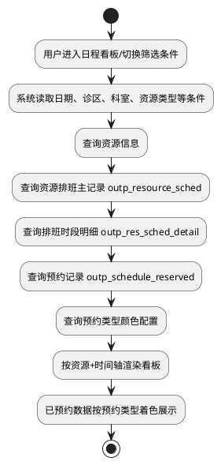
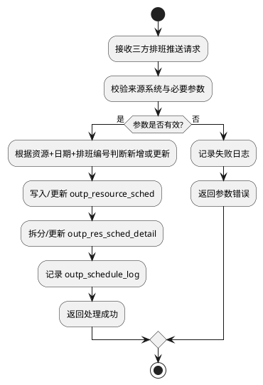
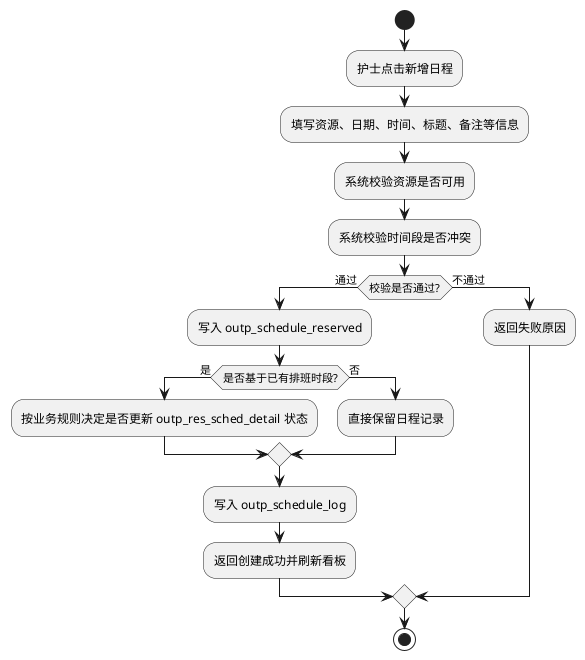
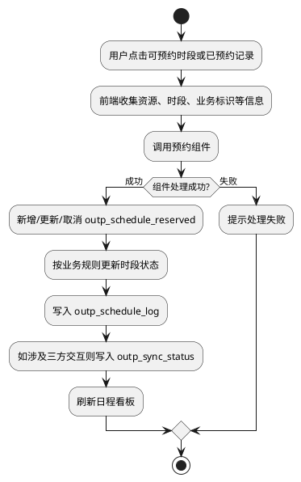
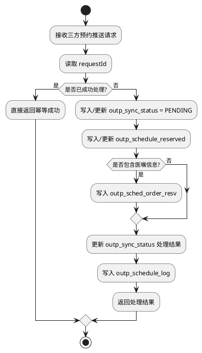
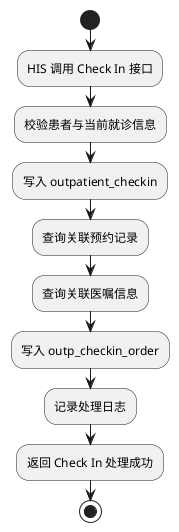
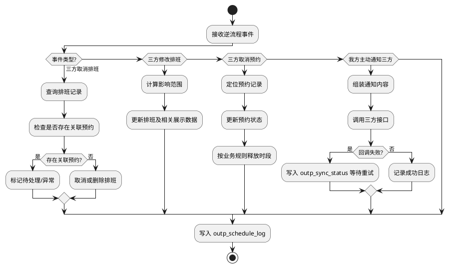
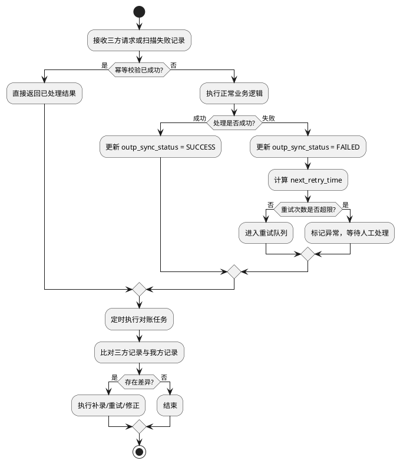

# 4.2.2.5 流程逻辑 - PlantUML 草稿

> 说明：这里是 `4.2.2.5` 下需要绘制的 **8 个流程图**。
> 不是 9 个，因为 `4.2.2.5.1` 是“设计说明”，不是独立业务流程。
> 真正需要画图的是 `4.2.2.5.2 ~ 4.2.2.5.9` 共 8 个流程。

---

## 4.2.2.5.2 日程看板加载流程

---

## 4.2.2.5.3 三方系统推送排班流程

---

## 4.2.2.5.4 护士手动新增日程流程

---

## 4.2.2.5.5 调用预约组件处理预约流程

---

## 4.2.2.5.6 三方系统推送预约数据流程

---

## 4.2.2.5.7 Check In 接诊关联流程

---

## 4.2.2.5.8 逆流程处理

---

## 4.2.2.5.9 幂等、重试与对账处理流程

