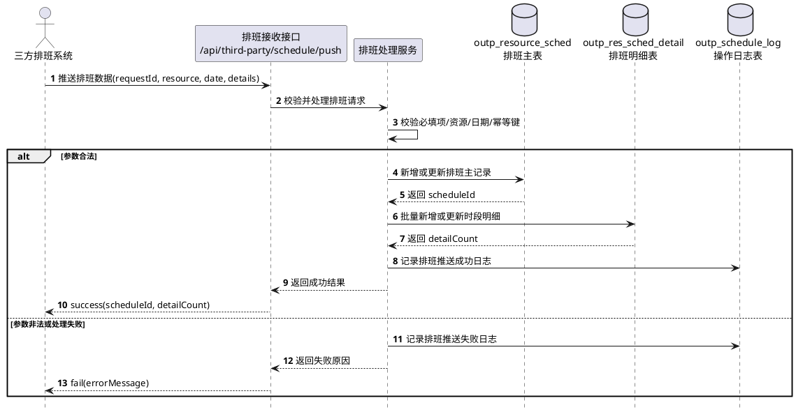
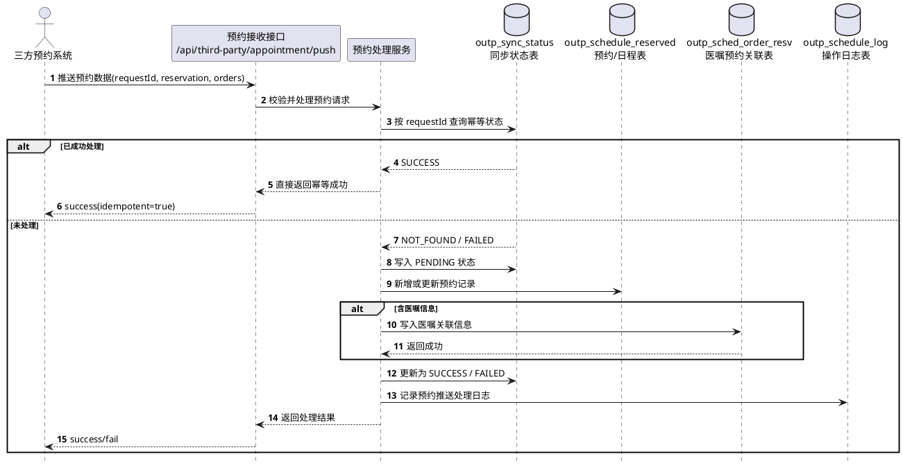
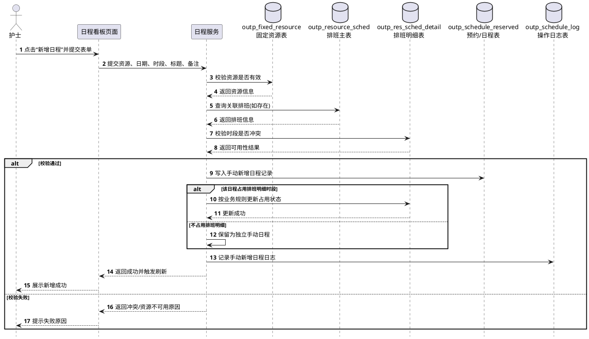
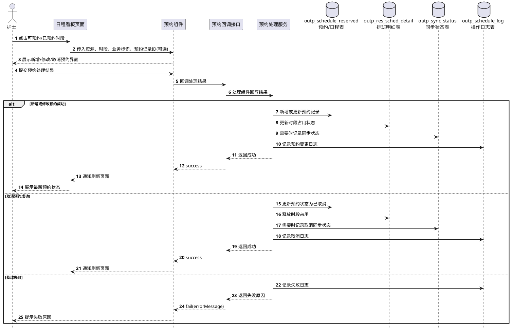
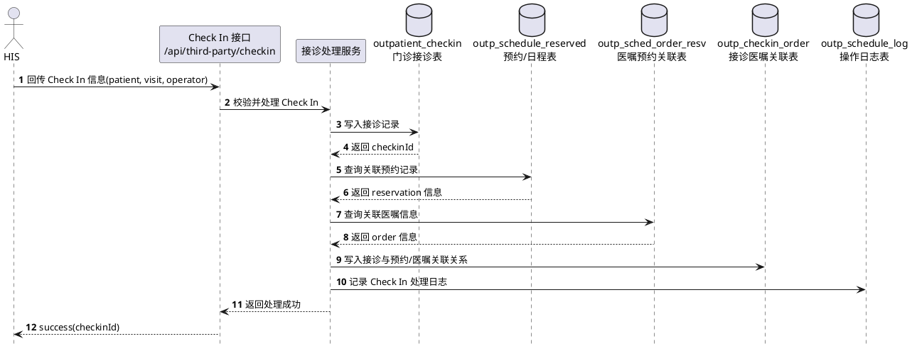
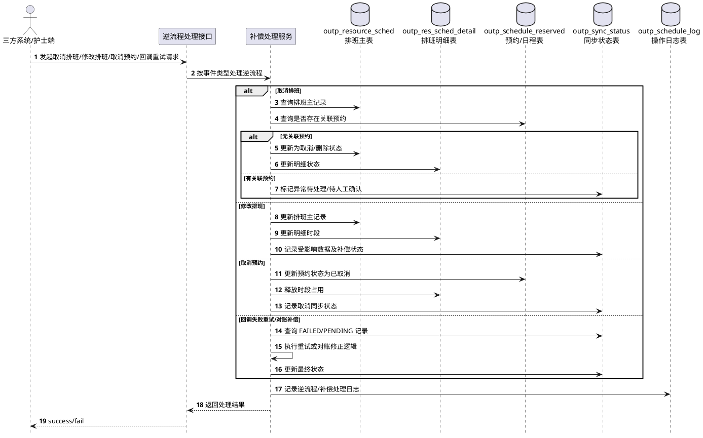

# 4.2.2.6 时序图 - 最终版目录 + PlantUML（2026-03-26）

> 用途：作为 `4.2.2.6 时序图` 章节的直接素材。
> 原则：只保留真正涉及“跨角色调用 + 关键落库/状态变化”的核心场景；查询展示类场景不作为核心时序图优先项。
> 依据：结合 `4.2.2.1 功能设计`、`4.2.2.3 输入输出`、`4.2.2.4 模块接口`、`4.2.2.5 流程逻辑` 进行收敛。

---

## 一、建议采用的最终时序图目录

### 4.2.2.6.1 三方推送排班时序图
- **适用功能**：对应 `4.2.2.1.1 日程表管理` 中排班来源展示能力、`4.2.2.5.3 三方系统推送排班流程`
- **图中参与对象**：三方排班系统、排班接收接口、排班处理服务、`outp_resource_sched`、`outp_res_sched_detail`、`outp_schedule_log`
- **表达重点**：排班数据接入、主表/明细表写入、日志留痕

### 4.2.2.6.2 三方推送预约数据时序图
- **适用功能**：对应 `4.2.2.1.1 日程表管理` 中预约数据展示来源、`4.2.2.5.6 三方推送预约处理流程`
- **图中参与对象**：三方预约系统、预约接收接口、预约处理服务、`outp_schedule_reserved`、`outp_sched_order_resv`、`outp_sync_status`、`outp_schedule_log`
- **表达重点**：预约写入、医嘱关联、同步状态记录、幂等处理入口

### 4.2.2.6.3 护士手动新增日程时序图
- **适用功能**：对应 `4.2.2.1.4 手动新增日程`、`4.2.2.5.4 护士手动新增日程流程`
- **图中参与对象**：护士端页面、日程服务、`outp_fixed_resource`、`outp_resource_sched`（可选查询）、`outp_res_sched_detail`（可选联动）、`outp_schedule_reserved`、`outp_schedule_log`
- **表达重点**：资源/时段校验、日程落库、是否联动排班明细状态

### 4.2.2.6.4 调用预约组件新增/修改/取消预约时序图
- **适用功能**：对应 `4.2.2.1.1 日程表管理` 中可预约/已预约时段操作、`4.2.2.5.5 调用预约组件处理预约流程`
- **图中参与对象**：护士端页面、预约组件、预约回调接口、预约处理服务、`outp_schedule_reserved`、`outp_res_sched_detail`、`outp_sync_status`、`outp_schedule_log`
- **表达重点**：组件调用、结果回写、预约状态更新、时段占用刷新

### 4.2.2.6.5 HIS Check In 接诊关联时序图
- **适用功能**：对应 `4.2.2.1.1 日程表管理` 后续接诊关联场景、`4.2.2.5.7 Check In 关联接诊流程`
- **图中参与对象**：HIS、Check In 接口、接诊处理服务、`outpatient_checkin`、`outp_schedule_reserved`、`outp_sched_order_resv`、`outp_checkin_order`、`outp_schedule_log`
- **表达重点**：Check In 后生成接诊记录，并与预约/医嘱建立关联

### 4.2.2.6.6 逆流程/补偿处理时序图
- **适用功能**：对应 `4.2.2.5.8 逆流程处理`、`4.2.2.5.9 幂等/重试/对账补偿处理`
- **图中参与对象**：三方系统/护士端页面、逆流程处理接口、补偿处理服务、`outp_resource_sched`、`outp_res_sched_detail`、`outp_schedule_reserved`、`outp_sync_status`、`outp_schedule_log`
- **表达重点**：取消排班、取消预约、修改排班、回调失败重试、对账补偿

---

## 二、建议不作为核心图优先落文档的场景

### 1. 日程看板加载时序图
- 该场景以查询聚合和页面渲染为主，更适合放在 `4.2.2.5.2 日程看板加载流程` 里用流程图说明。
- 如评审方坚持要补，可作为附加图放在 `4.2.2.6` 末尾，不建议排在 `4.2.2.6.1`。

### 2. 固定资源维护时序图
- `4.2.2.1.3 固定资源管理` 更偏后台配置维护，通常通过功能说明 + 接口说明即可支撑。
- 若后续要强调“停用/删除前校验是否存在关联日程”，再单独补图。

### 3. 预约记录查询/日志追溯时序图
- 该场景更偏查询展示，不如通过流程图和字段说明表达。
- 真正关键的是日志与同步状态表在核心场景中都要被串起来，而不是单独再画一个查询图。

---

## 三、PlantUML 草稿

## 4.2.2.6.1 三方推送排班时序图

---

## 4.2.2.6.2 三方推送预约数据时序图

---

## 4.2.2.6.3 护士手动新增日程时序图

---

## 4.2.2.6.4 调用预约组件新增/修改/取消预约时序图

---

## 4.2.2.6.5 HIS Check In 接诊关联时序图

---

## 4.2.2.6.6 逆流程/补偿处理时序图

---

## 四、落文档建议

1. `4.2.2.6` 正文中优先放这 6 张核心时序图即可，不建议再继续扩图。
2. `4.2.2.5` 的 8 张流程图与 `4.2.2.6` 的 6 张时序图要严格分工：
   - `4.2.2.5` 讲“业务步骤怎么走”
   - `4.2.2.6` 讲“参与对象如何交互、哪些表被写、状态如何变化”
3. `4.2.2.2.1 核心数据流转图` 需要单独重画，不要把这里的时序图内容硬塞进去。
4. 若需求侧坚持补“日程看板加载时序图”，建议作为附图追加在本文件最后，不进入主目录编号。
