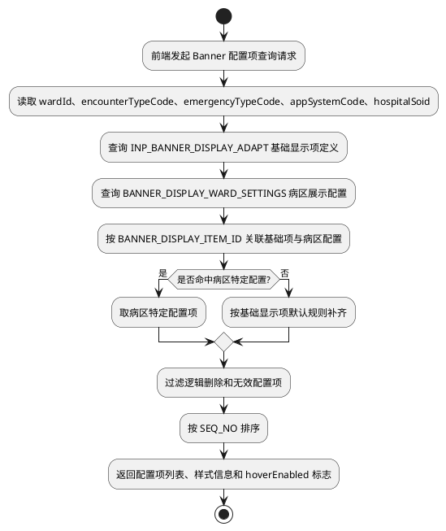
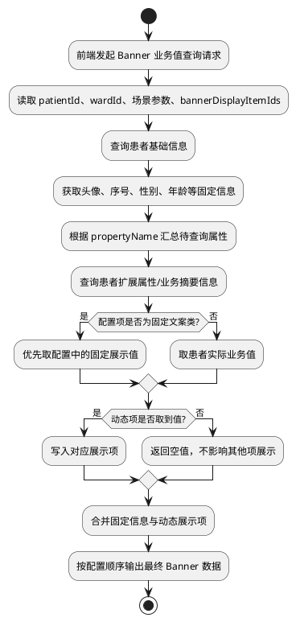
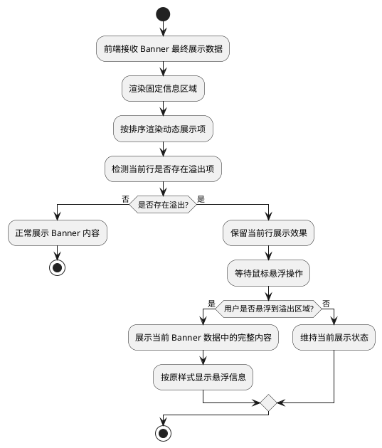

# 4.2.2.6 流程逻辑 - PlantUML

> 说明：本节对应 `4.2.2.6` 下 3 个核心流程图，分别对应 Banner 配置项查询、Banner 业务值查询与组装、Banner 前端渲染与悬浮展示。

---

## 4.2.2.6.2 Banner 配置项查询流程

---

## 4.2.2.6.3 Banner 业务值查询与组装流程

---

## 4.2.2.6.4 Banner 前端渲染与悬浮展示流程

