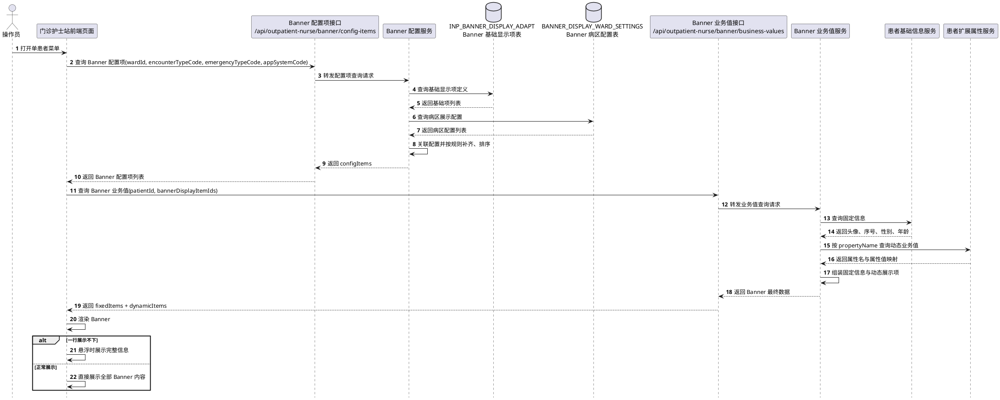
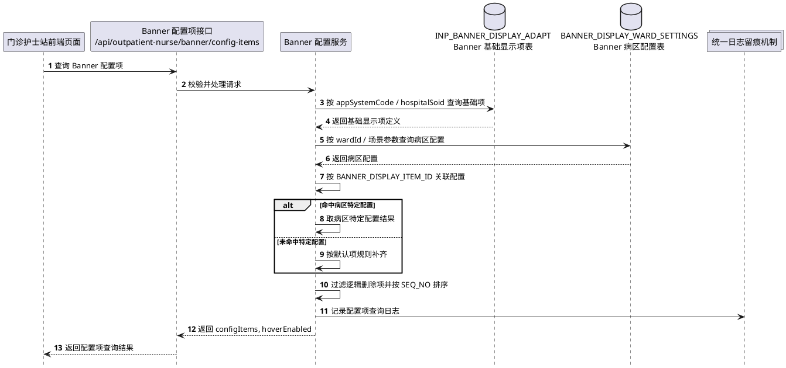
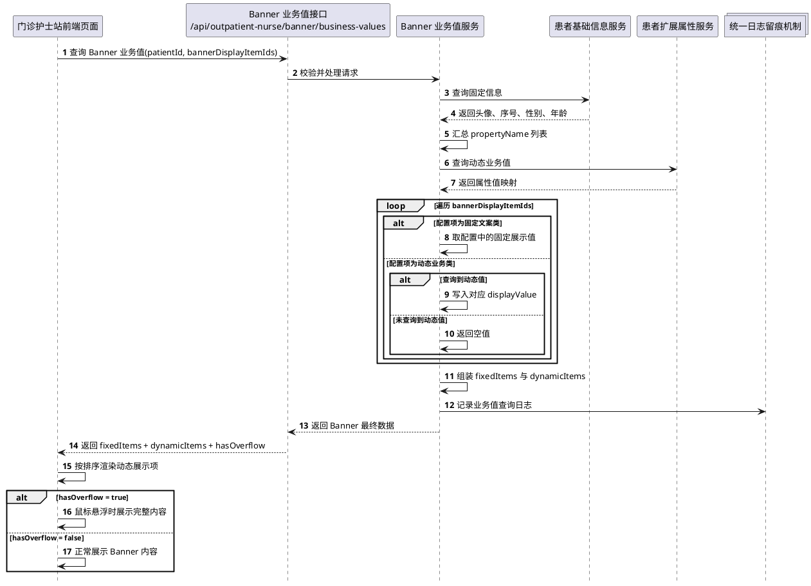

# 4.2.2.7 时序图 - PlantUML

> 用途：作为 `4.2.2.7 时序图` 章节的直接素材。
> 本版按 Banner 模块当前约定的“两接口”口径绘制：
> 1. Banner 配置项查询接口
> 2. Banner 业务值查询接口

---

## 4.2.2.7.1 设计说明

本节用于描述门诊护士站患者 Banner 模块在关键场景下的跨对象交互顺序，重点体现：
- 前端页面、配置项接口、业务值接口之间的调用顺序；
- `INP_BANNER_DISPLAY_ADAPT` 与 `BANNER_DISPLAY_WARD_SETTINGS` 的读取时点；
- 患者基础信息与动态业务值的查询时点；
- Banner 最终渲染与悬浮展示的形成顺序。

本版时序图优先覆盖以下三个核心场景：
1. 患者 Banner 整体加载时序；
2. Banner 配置项查询时序；
3. Banner 业务值查询与前端展示时序。

---

## 4.2.2.7.2 患者 Banner 整体加载时序图

---

## 4.2.2.7.3 Banner 配置项查询时序图

---

## 4.2.2.7.4 Banner 业务值查询与前端展示时序图

