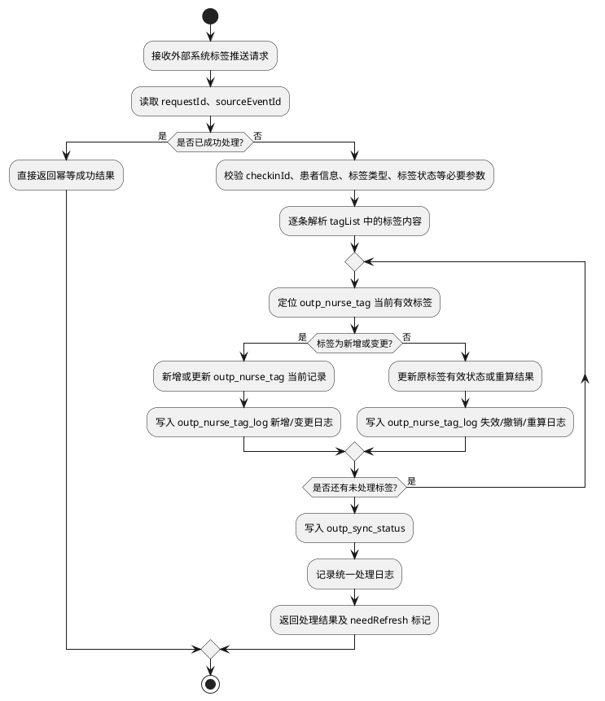

# 4.2.4.5.5 外部系统推送标签接口流程 - PlantUML

```plantuml
@startuml
start
:接收外部系统标签推送请求;
:读取 requestId、sourceEventId;
if (是否已成功处理?) then (是)
  :直接返回幂等成功结果;
else (否)
  :校验 checkinId、患者信息、标签类型、标签状态等必要参数;
  :逐条解析 tagList 中的标签内容;
  repeat
    :定位 outp_nurse_tag 当前有效标签;
    if (标签为新增或变更?) then (是)
      :新增或更新 outp_nurse_tag 当前记录;
      :写入 outp_nurse_tag_log 新增/变更日志;
    else (否)
      :更新原标签有效状态或重算结果;
      :写入 outp_nurse_tag_log 失效/撤销/重算日志;
    endif
  repeat while (是否还有未处理标签?) is (是)
  :写入 outp_sync_status;
  :记录统一处理日志;
  :返回处理结果及 needRefresh 标记;
endif
stop
@enduml
```
