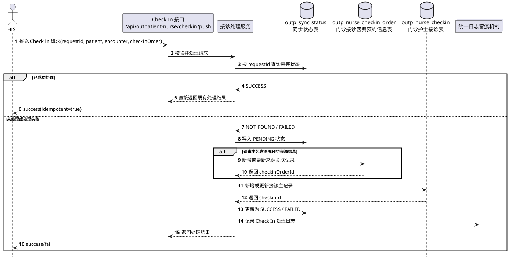
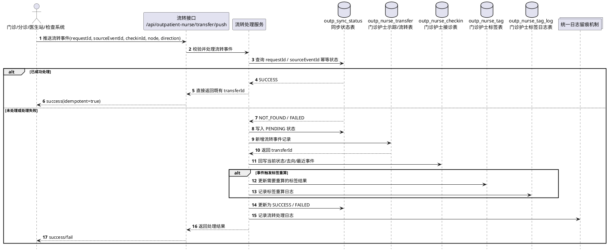
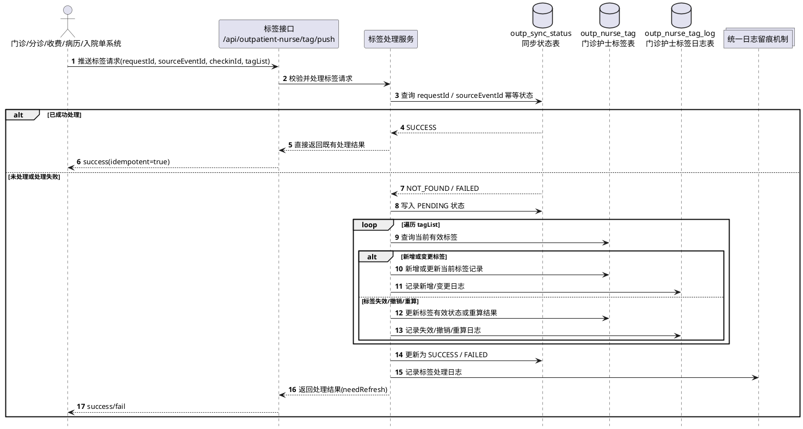
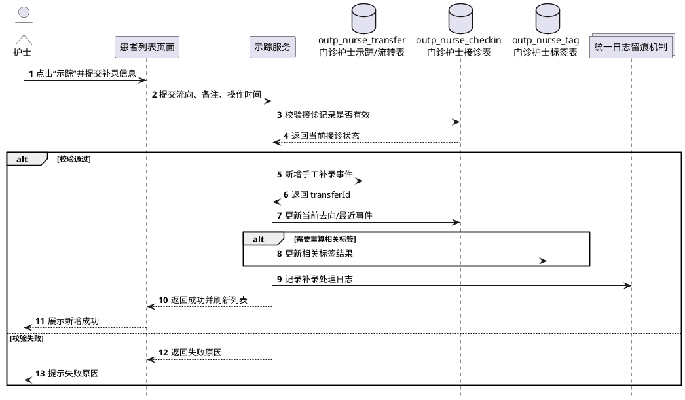
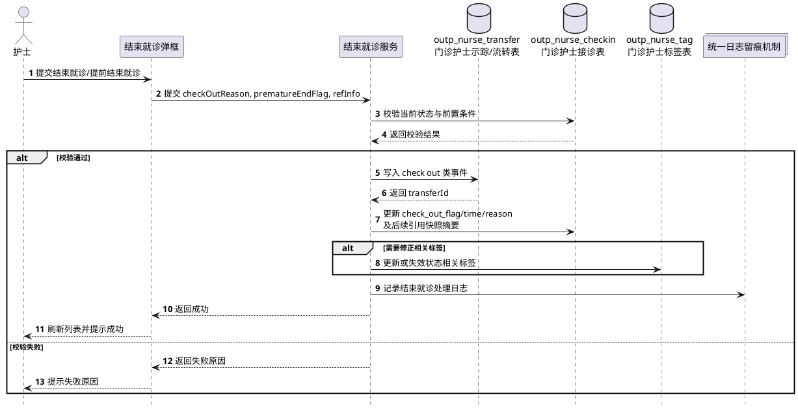
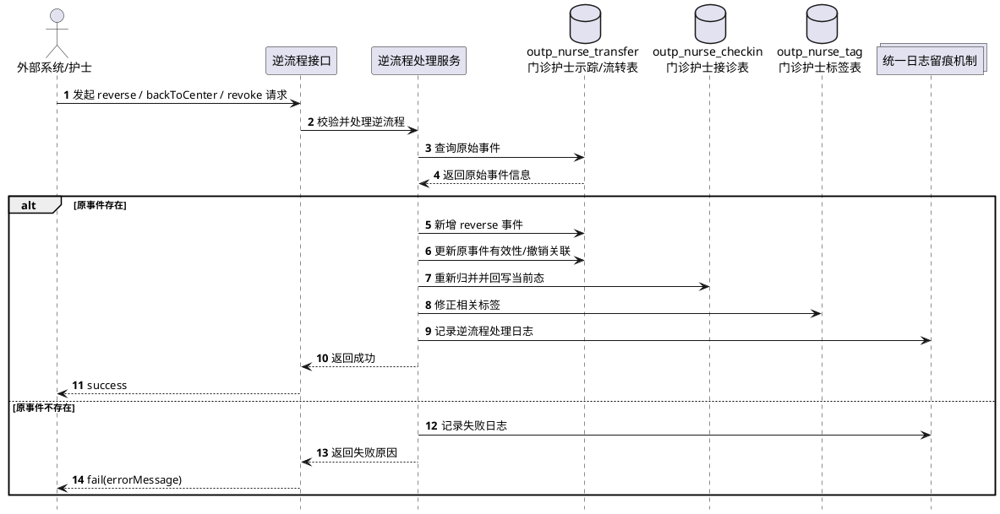
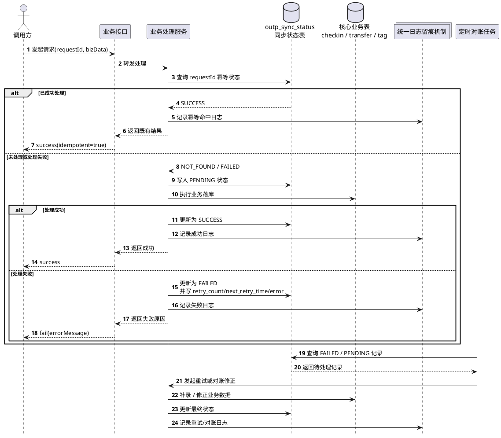

# 4.2.4.6 时序图 - PlantUML（标签接口调整版）

> 用途：作为 `4.2.4.6 时序图` 章节的直接素材。
>
> 本版根据新增“外部系统写入标签接口”要求进行了重排，新增 `4.2.4.6.4 外部系统写入标签时序图`，后续时序图编号顺延。

---

## 4.2.4.6.1 设计说明

本节用于描述门诊患者列表模块在关键业务场景下的跨对象交互顺序，重点体现：

- 调用发起方与我方接口、页面、服务之间的交互关系；
- 接诊主表、流转事件表、标签表、同步状态表的写入时点；
- 正常处理、幂等处理、逆流程处理、补偿处理的进入节点；
- 患者当前状态、当前去向、标签结果和日志留痕的形成顺序。

本版时序图优先覆盖以下七类核心场景：

1. HIS Check In 接诊写入；
2. 外部系统推送患者流转；
3. 外部系统写入标签；
4. 护士手工补录患者流向；
5. 结束就诊 / 提前结束就诊；
6. 逆流程处理；
7. 幂等、重试与对账处理。

---

## 4.2.4.6.2 HIS Check In 接诊写入时序图

---

## 4.2.4.6.3 外部系统推送患者流转时序图

---

## 4.2.4.6.4 外部系统写入标签时序图

---

## 4.2.4.6.5 护士手工补录患者流向时序图

---

## 4.2.4.6.6 结束就诊 / 提前结束就诊时序图

---

## 4.2.4.6.7 逆流程处理时序图

---

## 4.2.4.6.8 幂等、重试与对账处理时序图

