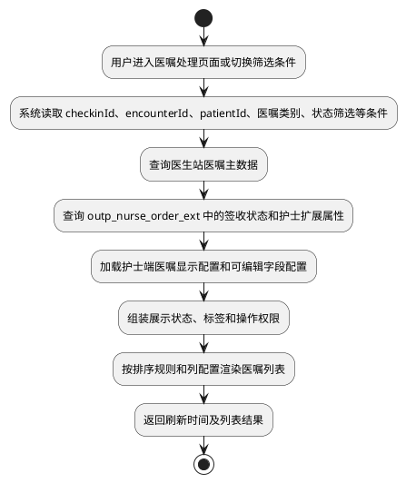
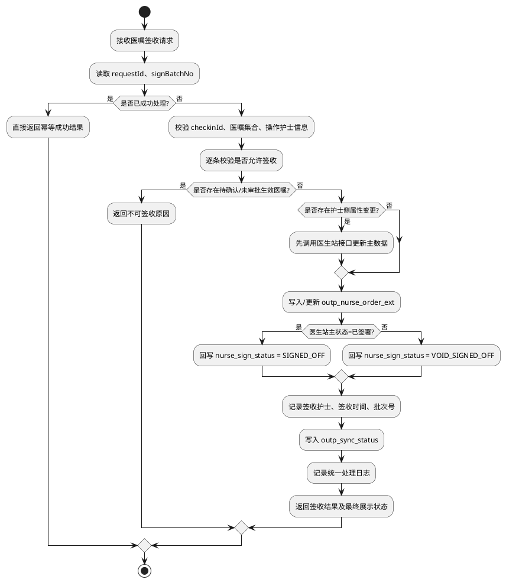
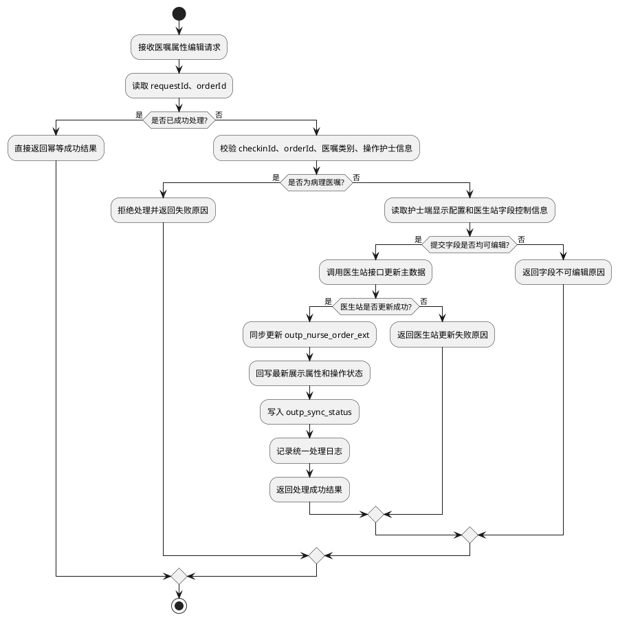
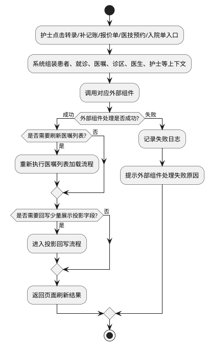
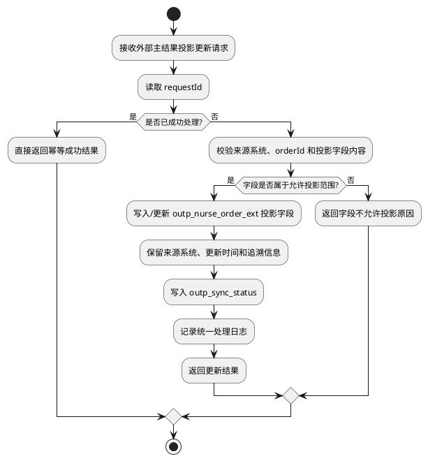
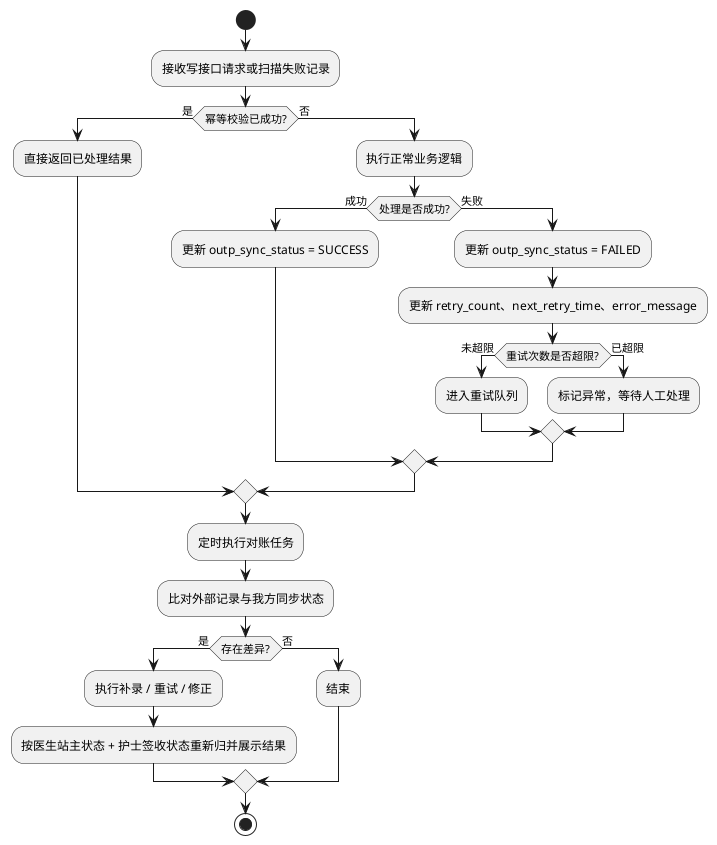

# 4.2.7.5 流程逻辑 - PlantUML 草稿

> 说明：这里是 `4.2.7.5` 下需要绘制的 **6 个流程图**
> `4.2.7.5.1` 为设计说明，不是独立业务流程
> 真正需要画图的是 `4.2.7.5.2 ~ 4.2.7.5.7`

---

## 4.2.7.5.2 医嘱列表加载流程

---

## 4.2.7.5.3 医嘱签收流程

---

## 4.2.7.5.4 医嘱属性编辑流程

---

## 4.2.7.5.5 外部组件调用协同流程

---

## 4.2.7.5.6 外部主结果投影回写流程

---

## 4.2.7.5.7 幂等、重试与对账处理流程

