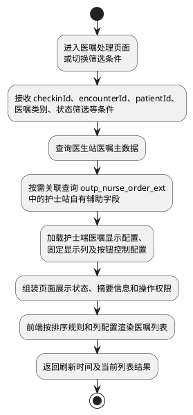
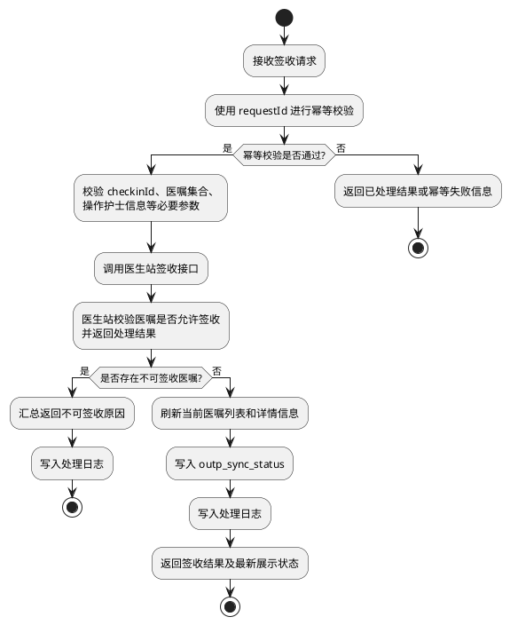
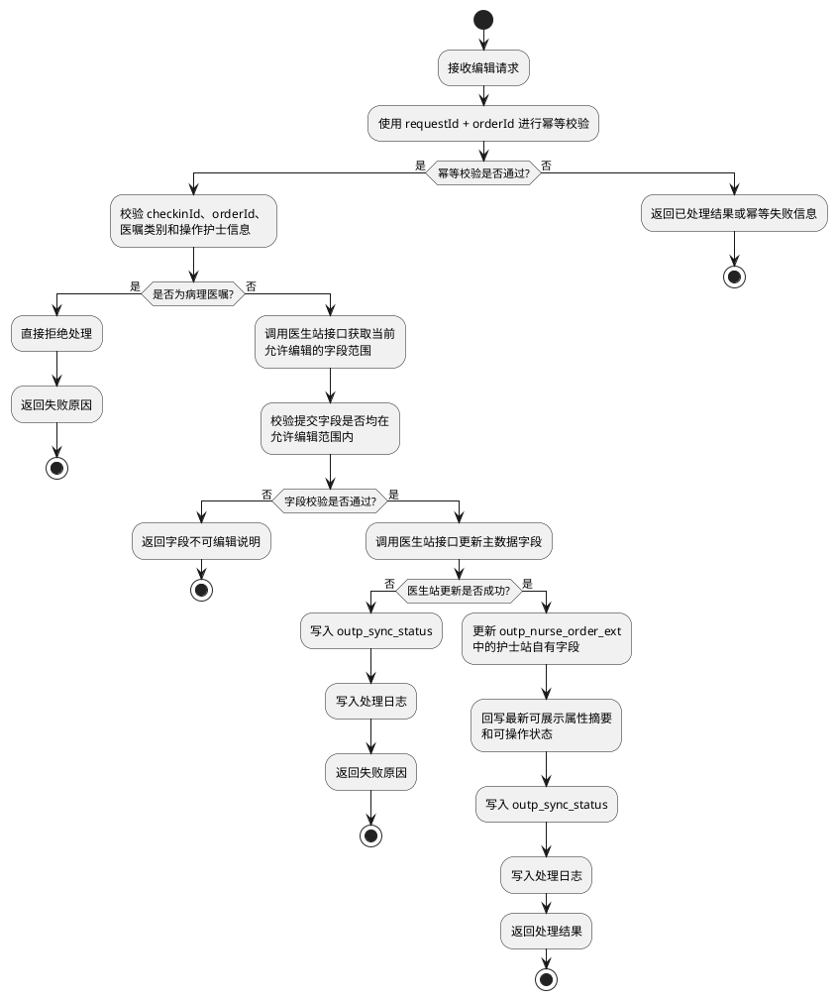
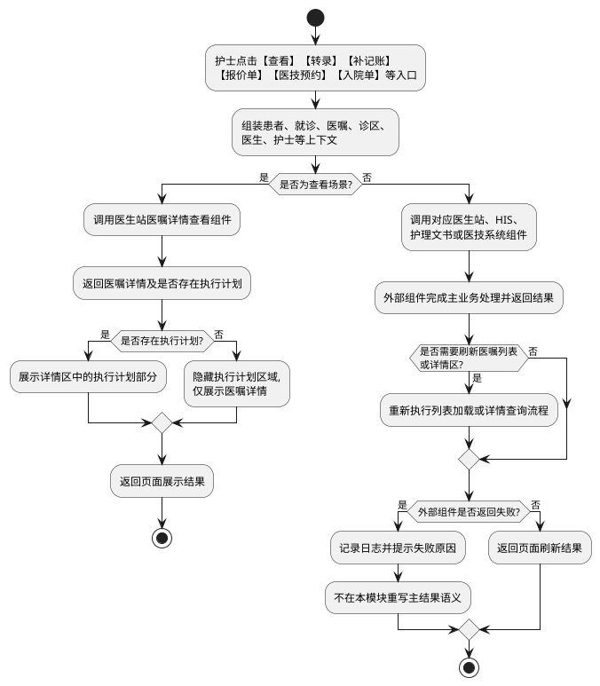
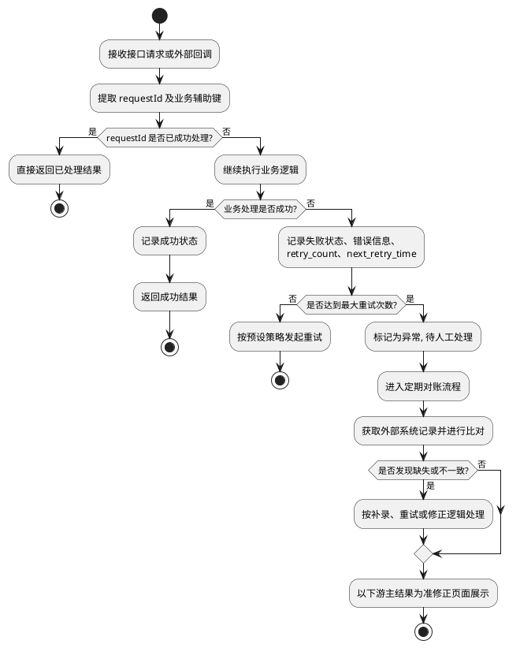

# 4.2.7.5 流程逻辑 PlantUML 流程图

## 4.2.7.5.2 医嘱列表加载流程

```plantuml
@startuml
start
:进入医嘱处理页面\n或切换筛选条件;
:接收 checkinId、encounterId、patientId、\n医嘱类别、状态筛选等条件;
:查询医生站医嘱主数据;
:按需关联查询 outp_nurse_order_ext\n中的护士站自有辅助字段;
:加载护士端医嘱显示配置、\n固定显示列及按钮控制配置;
:组装页面展示状态、摘要信息和操作权限;
:前端按排序规则和列配置渲染医嘱列表;
:返回刷新时间及当前列表结果;
stop
@enduml
```

## 4.2.7.5.3 医嘱签收流程

```plantuml
@startuml
start
:接收签收请求;
:使用 requestId 进行幂等校验;
if (幂等校验是否通过?) then (是)
  :校验 checkinId、医嘱集合、\n操作护士信息等必要参数;
  :调用医生站签收接口;
  :医生站校验医嘱是否允许签收\n并返回处理结果;
  if (是否存在不可签收医嘱?) then (是)
    :汇总返回不可签收原因;
    :写入处理日志;
    stop
  else (否)
    :刷新当前医嘱列表和详情信息;
    :写入 outp_sync_status;
    :写入处理日志;
    :返回签收结果及最新展示状态;
    stop
  endif
else (否)
  :返回已处理结果或幂等失败信息;
  stop
endif
@enduml
```

## 4.2.7.5.4 医嘱属性编辑流程

```plantuml
@startuml
start
:接收编辑请求;
:使用 requestId + orderId 进行幂等校验;
if (幂等校验是否通过?) then (是)
  :校验 checkinId、orderId、\n医嘱类别和操作护士信息;
  if (是否为病理医嘱?) then (是)
    :直接拒绝处理;
    :返回失败原因;
    stop
  else (否)
    :调用医生站接口获取当前\n允许编辑的字段范围;
    :校验提交字段是否均在\n允许编辑范围内;
    if (字段校验是否通过?) then (否)
      :返回字段不可编辑说明;
      stop
    else (是)
      :调用医生站接口更新主数据字段;
      if (医生站更新是否成功?) then (否)
        :写入 outp_sync_status;
        :写入处理日志;
        :返回失败原因;
        stop
      else (是)
        :更新 outp_nurse_order_ext\n中的护士站自有字段;
        :回写最新可展示属性摘要\n和可操作状态;
        :写入 outp_sync_status;
        :写入处理日志;
        :返回处理结果;
        stop
      endif
    endif
  endif
else (否)
  :返回已处理结果或幂等失败信息;
  stop
endif
@enduml
```

## 4.2.7.5.5 模块与外部组件调用协同流程

```plantuml
@startuml
start
:护士点击【查看】【转录】【补记账】\n【报价单】【医技预约】【入院单】等入口;
:组装患者、就诊、医嘱、诊区、\n医生、护士等上下文;
if (是否为查看场景?) then (是)
  :调用医生站医嘱详情查看组件;
  :返回医嘱详情及是否存在执行计划;
  if (是否存在执行计划?) then (是)
    :展示详情区中的执行计划部分;
  else (否)
    :隐藏执行计划区域,\n仅展示医嘱详情;
  endif
  :返回页面展示结果;
  stop
else (否)
  :调用对应医生站、HIS、\n护理文书或医技系统组件;
  :外部组件完成主业务处理并返回结果;
  if (是否需要刷新医嘱列表\n或详情区?) then (是)
    :重新执行列表加载或详情查询流程;
  else (否)
  endif
  if (外部组件是否返回失败?) then (是)
    :记录日志并提示失败原因;
    :不在本模块重写主结果语义;
  else (否)
    :返回页面刷新结果;
  endif
  stop
endif
@enduml
```

## 4.2.7.5.6 幂等、重试与对账处理流程

```plantuml
@startuml
start
:接收接口请求或外部回调;
:提取 requestId 及业务辅助键;
if (requestId 是否已成功处理?) then (是)
  :直接返回已处理结果;
  stop
else (否)
  :继续执行业务逻辑;
  if (业务处理是否成功?) then (是)
    :记录成功状态;
    :返回成功结果;
    stop
  else (否)
    :记录失败状态、错误信息、\nretry_count、next_retry_time;
    if (是否达到最大重试次数?) then (否)
      :按预设策略发起重试;
      stop
    else (是)
      :标记为异常, 待人工处理;
      :进入定期对账流程;
      :获取外部系统记录并进行比对;
      if (是否发现缺失或不一致?) then (是)
        :按补录、重试或修正逻辑处理;
      else (否)
      endif
      :以下游主结果为准修正页面展示;
      stop
    endif
  endif
endif
@enduml
```
