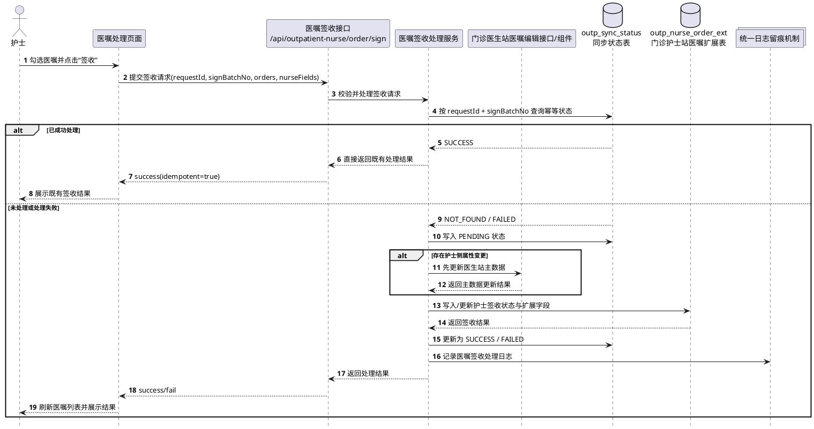
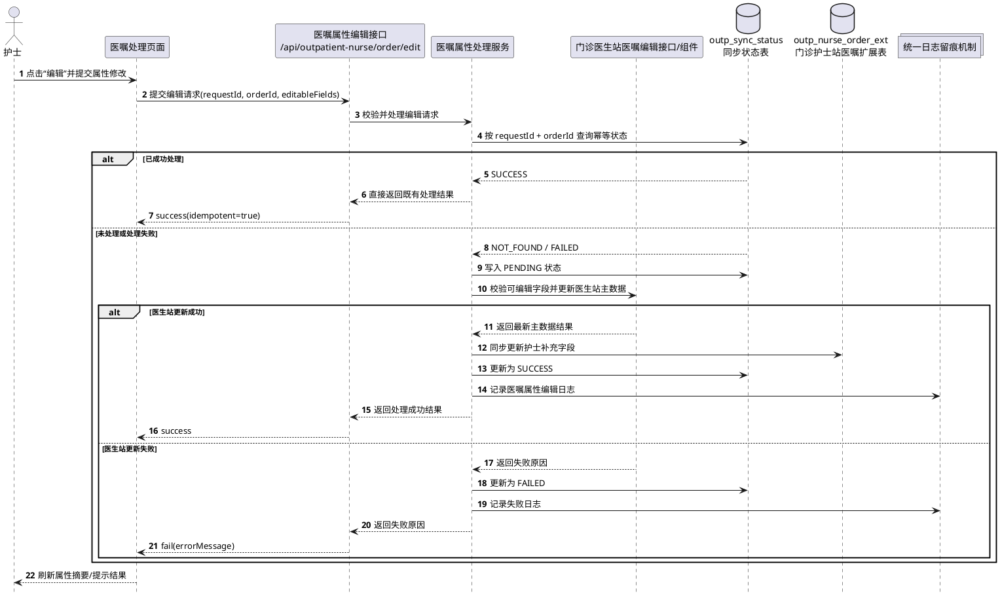
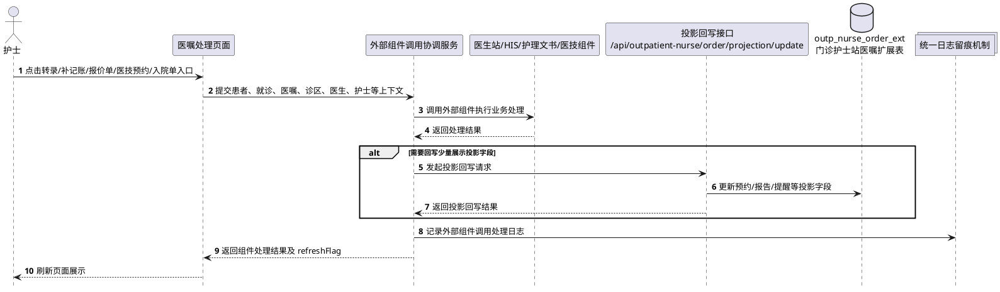
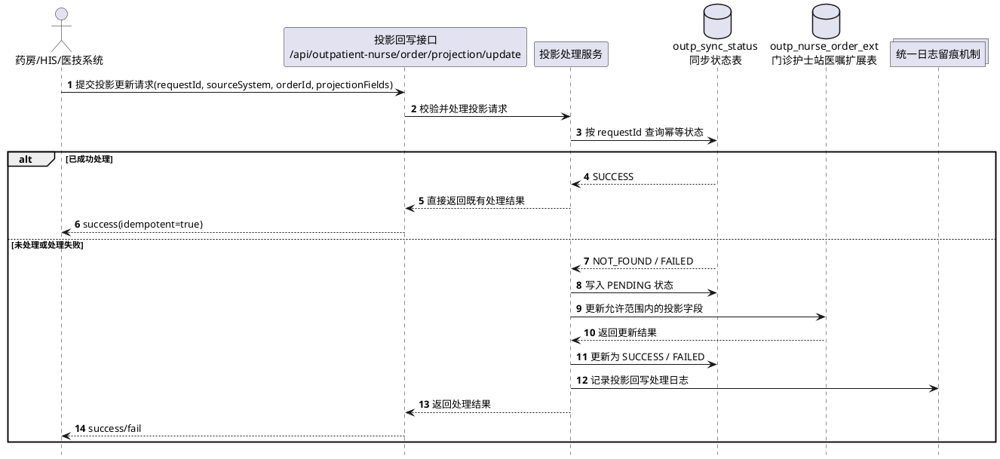
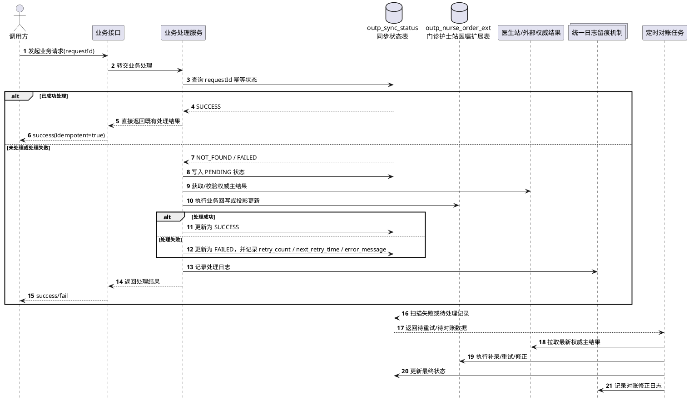

# 4.2.7.6 时序图 - PlantUML

> 用途：作为 `4.2.7.6 时序图` 章节的直接素材
> 原则：优先保留真正涉及“跨角色调用 + 主结果/扩展结果写入 + 幂等/补偿处理”的核心场景；纯查询展示场景不作为主时序图优先项
> 依据：结合 `4.2.7.3 输入输出`、`4.2.7.4 模块接口`、`4.2.7.5 流程逻辑` 收敛

---

## 一、建议采用的最终时序图目录

### 4.2.7.6.1 医嘱签收时序图
- **适用功能**：对应 `4.2.7.5.3 医嘱签收流程`
- **图中参与对象**：护士、医嘱处理页面、医嘱签收接口、医嘱签收处理服务、门诊医生站医嘱编辑接口/组件、`outp_sync_status`、`outp_nurse_order_ext`、日志机制
- **表达重点**：幂等校验、医生站主数据先更新、护士签收状态回写、作废已签收场景承接

### 4.2.7.6.2 医嘱属性编辑时序图
- **适用功能**：对应 `4.2.7.5.4 医嘱属性编辑流程`
- **图中参与对象**：护士、医嘱处理页面、医嘱属性编辑接口、医嘱属性处理服务、门诊医生站医嘱编辑接口/组件、`outp_sync_status`、`outp_nurse_order_ext`、日志机制
- **表达重点**：字段可编辑范围校验、医生站主数据更新、护士站扩展字段同步

### 4.2.7.6.3 外部组件调用协同时序图
- **适用功能**：对应 `4.2.7.5.5 外部组件调用协同流程`
- **图中参与对象**：护士、医嘱处理页面、外部组件调用协调服务、门诊医生站/HIS/护理文书/医技组件、投影回写接口、`outp_nurse_order_ext`、日志机制
- **表达重点**：上下文透传、外部组件处理、结果回传、页面刷新与投影回写分流

### 4.2.7.6.4 外部主结果投影回写时序图
- **适用功能**：对应 `4.2.7.5.6 外部主结果投影回写流程`
- **图中参与对象**：外部系统、投影回写接口、投影处理服务、`outp_sync_status`、`outp_nurse_order_ext`、日志机制
- **表达重点**：投影字段范围校验、扩展表更新、幂等接入

### 4.2.7.6.5 幂等、重试与对账处理时序图
- **适用功能**：对应 `4.2.7.5.7 幂等、重试与对账处理流程`
- **图中参与对象**：调用方、业务接口、业务处理服务、`outp_sync_status`、核心结果表、日志机制、对账任务
- **表达重点**：幂等命中、失败重试、定期对账修正、按权威主结果归并展示

---

## 二、建议不作为主时序图优先落文档的场景

### 1. 医嘱列表加载时序图
- 该场景以查询聚合和页面渲染为主，更适合放在 `4.2.7.5.2 医嘱列表加载流程` 中用流程逻辑说明
- 若评审方坚持需要，可作为附图追加在 `4.2.7.6` 末尾，不建议排在主目录前列

---

## 三、PlantUML 草稿

## 4.2.7.6.1 医嘱签收时序图

---

## 4.2.7.6.2 医嘱属性编辑时序图

---

## 4.2.7.6.3 外部组件调用协同时序图

---

## 4.2.7.6.4 外部主结果投影回写时序图

---

## 4.2.7.6.5 幂等、重试与对账处理时序图

