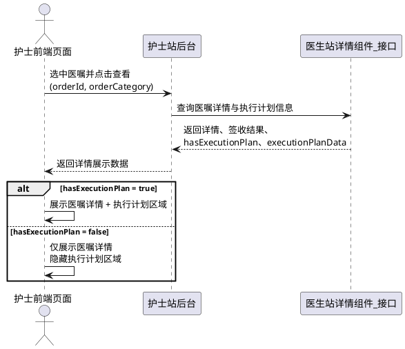
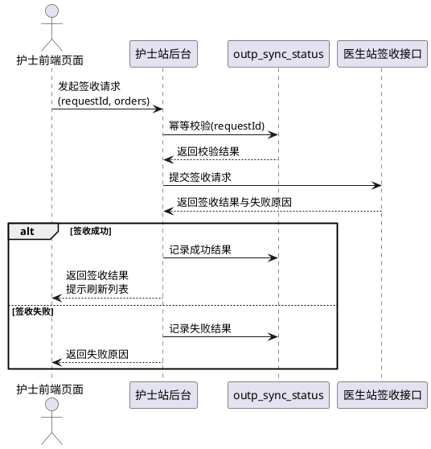
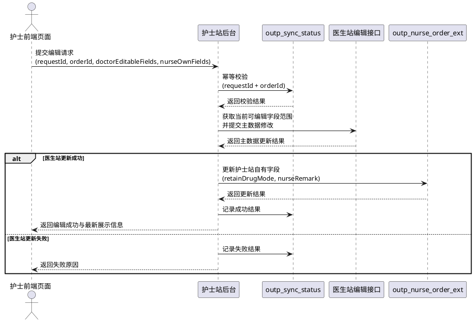
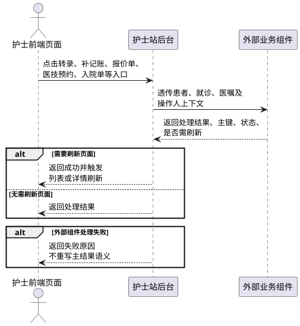

# 4.2.7.6 时序图 PlantUML 版

## 4.2.7.6.1 医嘱查看与执行计划展示时序图

```plantuml
@startuml
actor 护士前端页面 as U
participant 护士站后台 as N
participant 医生站详情组件_接口 as D

U -> N : 选中医嘱并点击查看\n(orderId, orderCategory)
N -> D : 查询医嘱详情与执行计划信息
D --> N : 返回详情、签收结果、\nhasExecutionPlan、executionPlanData
N --> U : 返回详情展示数据

alt hasExecutionPlan = true
  U -> U : 展示医嘱详情 + 执行计划区域
else hasExecutionPlan = false
  U -> U : 仅展示医嘱详情\n隐藏执行计划区域
end
@enduml
```

## 4.2.7.6.2 医嘱签收时序图

```plantuml
@startuml
actor 护士前端页面 as U
participant 护士站后台 as N
participant outp_sync_status as S
participant 医生站签收接口 as D

U -> N : 发起签收请求\n(requestId, orders)
N -> S : 幂等校验(requestId)
S --> N : 返回校验结果
N -> D : 提交签收请求
D --> N : 返回签收结果与失败原因

alt 签收成功
  N -> S : 记录成功结果
  N --> U : 返回签收结果\n提示刷新列表
else 签收失败
  N -> S : 记录失败结果
  N --> U : 返回失败原因
end
@enduml
```

## 4.2.7.6.3 医嘱属性编辑时序图

```plantuml
@startuml
actor 护士前端页面 as U
participant 护士站后台 as N
participant outp_sync_status as S
participant 医生站编辑接口 as D
participant outp_nurse_order_ext as E

U -> N : 提交编辑请求\n(requestId, orderId, doctorEditableFields, nurseOwnFields)
N -> S : 幂等校验\n(requestId + orderId)
S --> N : 返回校验结果
N -> D : 获取当前可编辑字段范围\n并提交主数据修改
D --> N : 返回主数据更新结果

alt 医生站更新成功
  N -> E : 更新护士站自有字段\n(retainDrugMode, nurseRemark)
  E --> N : 返回更新结果
  N -> S : 记录成功结果
  N --> U : 返回编辑成功与最新展示信息
else 医生站更新失败
  N -> S : 记录失败结果
  N --> U : 返回失败原因
end
@enduml
```

## 4.2.7.6.4 模块与外部组件调用协同时序图

```plantuml
@startuml
actor 护士前端页面 as U
participant 护士站后台 as N
participant 外部业务组件 as X

U -> N : 点击转录、补记账、报价单、\n医技预约、入院单等入口
N -> X : 透传患者、就诊、医嘱及\n操作人上下文
X --> N : 返回处理结果、主键、状态、\n是否需刷新

alt 需要刷新页面
  N --> U : 返回成功并触发\n列表或详情刷新
else 无需刷新页面
  N --> U : 返回处理结果
end

alt 外部组件处理失败
  N --> U : 返回失败原因\n不重写主结果语义
end
@enduml
```
