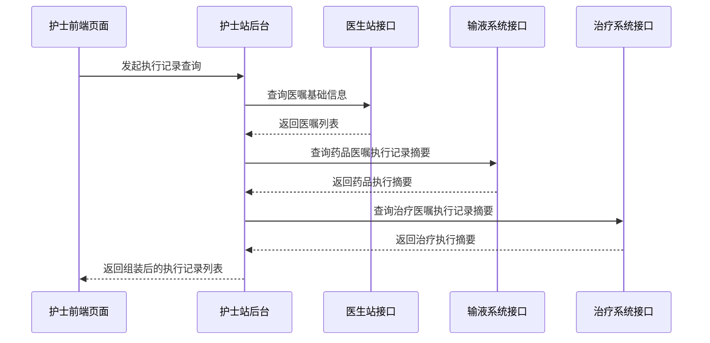
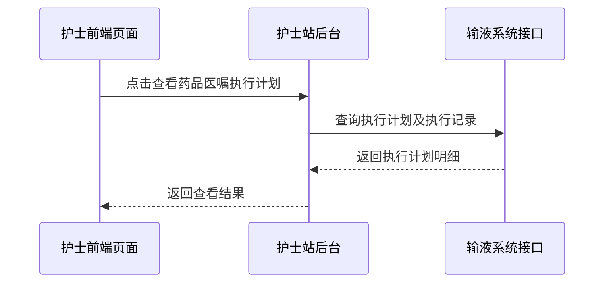
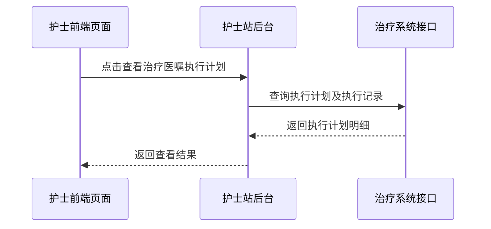

# 4.2.8.4.6 时序图

## 4.2.8.4.6.1 医嘱执行记录列表查询时序图

```mermaid
sequenceDiagram
    participant U as 护士前端页面
    participant N as 护士站后台
    participant D as 医生站接口
    participant I as 输液系统接口
    participant T as 治疗系统接口

    U->>N: 发起执行记录查询
    N->>D: 查询医嘱基础信息
    D-->>N: 返回医嘱列表
    N->>I: 查询药品医嘱执行记录摘要
    I-->>N: 返回药品执行摘要
    N->>T: 查询治疗医嘱执行记录摘要
    T-->>N: 返回治疗执行摘要
    N-->>U: 返回组装后的执行记录列表
```

## 4.2.8.4.6.2 药品医嘱执行计划查看时序图

```mermaid
sequenceDiagram
    participant U as 护士前端页面
    participant N as 护士站后台
    participant I as 输液系统接口

    U->>N: 点击查看药品医嘱执行计划
    N->>I: 查询执行计划及执行记录
    I-->>N: 返回执行计划明细
    N-->>U: 返回查看结果
```

## 4.2.8.4.6.3 治疗医嘱执行计划查看时序图

```mermaid
sequenceDiagram
    participant U as 护士前端页面
    participant N as 护士站后台
    participant T as 治疗系统接口

    U->>N: 点击查看治疗医嘱执行计划
    N->>T: 查询执行计划及执行记录
    T-->>N: 返回执行计划明细
    N-->>U: 返回查看结果
```
